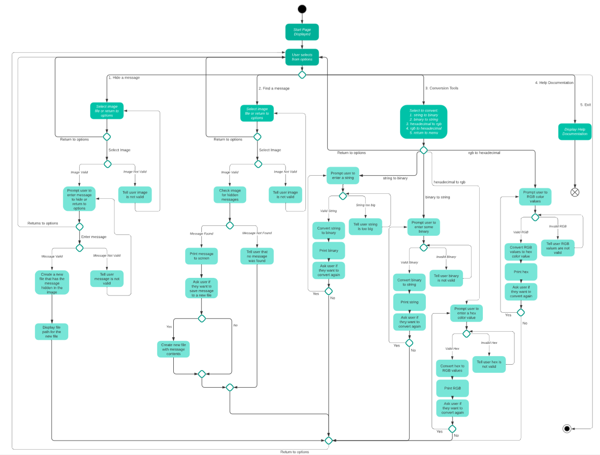

# SteggyHide


## Help Documentation

### **Installing** 
SteggyHide is a Command Line Application

Clone the source files from [github.com/Jezzabell91/SteggyHide](https://github.com/Jezzabell91/SteggyHide)

In your target directory run the command from terminal

```terminal
git clone https://github.com/Jezzabell91/SteggyHide
```

From here run the command 

```terminal
cd src/
```

And run the steggyhide script which will install the required gems

```terminal
./steggyhide.sh
```

To run the program use

```terminal
ruby steggyhide.rb
```
### **Gems**
SteggyHide uses four gems
1. TTY-Prompt
2. TTY-Font
3. Pastel
4. Chunky_PNG 

If you don't wish to run the steggyhide shell script you can install each of theses gems. 

```terminal
gem install tty-prompt
gem install tty-font
gem install pastel
gem install chunky_png
```
### **System/Hardware Requirements**
There are no specific hardware requirements other than a device that can run terminal applications.

For software ruby 2.0 or greater is required

### **How to use:**

**Command Line Arguments**


COMMAND: 

-h

 --help

Takes you to help documentation


COMMAND:

 -hex 'hexvalue'

Use the -hex argument with a hex value with 3 to 6 digits to convert to RGB values
Please note command line arguments cannot begin with #
Examples:

```terminal
Good:
hex a12fed
hex 0x23EEFD

Bad:
hex #DE3    #will result in an error
```


COMMAND:    
-rgb 'red' 'green' 'blue'


Use the -rgb argument with RGB values. Each value needs to be an integer between 0 and 255.
Example:
```terminal
rgb 231 34 67
```

INSTRUCTIONS ON HOW TO USE EACH FEATURE: 

HIDE A MESSAGE

1. If you're not sure what images are in your directory use the prompt to list images

2. Select a png image by entering the filepath. If the filepath does not end in .png
  or if the file does not exist in the directory an error will occur and you will
  be given the option to retry or exit back to the main menu.

3. Enter a message that you want to hide. If the message is too large
  to be hidden in the chosen image an error will occur and you will be taken back to the main menu.

4. SteggyHide now does it's thing and encodes the message in the image

5. Finally, enter the filepath for the new image which has the secret message hidden inside.
If the filepath does not end in .png an error will occur and you will be given the option to retry.

FIND A MESSAGE

1. If you're not sure what images are in your directory use the prompt to list images

2. Select a png image by entering the filepath. If the filepath does not end in .png
  or if the file does not exist in the directory an error will occur and you will
  be given the option to retry or exit back to the main menu.

3. SteggyHide now does it's thing and if there is a hidden message it will decode the message

4. If you want to save the message in a text file input the filepath where you want to save

CONVERSION TOOLS

Select which conversion tool you would like to use from the list

1. Convert from string to binary - Enter a string, just make sure it isn't too long.

2. Convert from binary to string - Enter the binary and make sure there's only '1's and '0's.

3. Convert from hexadecimal to RGB - Enter a hexadecimal value with at least 3 digits.
Can use common formats including hex numbers prefixed with 0x and # 

4. Convert from RGB to hexadecimal - Enter values for Red, Green and Blue. Numbers must be between 0 and 255.

---

## References

Idea for the app was inspired by Computerphile's video on steganography (Computerphile, 2015). Many of the methods were adapted from DrapsTV's python tutorial for hiding text in images (DrapsTV, 2014)

Computerphile (2015) *Secrets Hidden in Images (Steganography) - Computerphile* Available at: https://youtu.be/TWEXCYQKyDc (Accessed: 25 September 2020).

DrapsTV (2014) *Steganography Tutorial - Hiding Text inside an Image* Available at: https://youtu.be/q3eOOMx5qoo (Accessed: 28 September 2020).

--- 

## Purpose and Scope

### What does it do?
SteggyHide is a terminal app that handles image based steganography. It can hide a user written message inside an png image, it can read a hidden message from a user selected image. SteggyHide also has four conversion tools if users simply want to do conversions between hexadecimal and RGB color values as well between strings and binary. Users can use command line arguments to quickly convert hex to rgb (-hex 'hexvalue') and rgb to hex (-rgb 'red' 'green' 'blue') or find how to use SteggyHide's features (-h). 

### Why make it? 
Secrets can be fun and SteggyHide allows a user to create secrets to share, read secrets that they've been sent. It also allows the user to have an introduction to steganography and working with hexadecimal and RGB values. Making it has been an exercise in learning. There have been many frustrations but also a similar level of wins and my knowledge of ruby and programming has increased significantly by creating this application.   

### Who is the audience? 
The audience is primarily for groups of friends who want to show off something cool to each other and share in a bit of fun. Curious learners will also find it useful to discover steganography, something that they may not have even been aware of. 

### How is it used? 
A user will start the application in the terminal and they can pass in options as command line arguments. Command line options include -h, --help, -hex, -rgb. Once the application has started and the user goes past the start page they will be presented with an options menu which will present them with the options to hide a message, find a message, use conversion tools, access help documentation to understand how to use the application and finally an option to exit the application. 

### Overall Scope
The scope of SteggyHide is limited and this is due to time constraints and current knowledge constraints. It can only handle PNG image files and secret messages can only be found if they were previously encoded by SteggyHide. The encoding method is very inelegant and unrefined. In future versions I would like to implement different methods of encoding, ability to handle most image types, ability to decode from externally encoded images. 

---

## Features

### Feature 1: **Hide message in an image**
This feature allows the user to hide a message within an image and then save a new image with the message encoded. The application can only handle .png image files as the ChunkyPNG gem is used to handle image functions. Errors are handled if the wrong filetype is used, if the image file does not exist or if the message is too large to hide in the chosen image. 


### Feature 2: **Find message in an image**
This feature allows the user to find a message within an image and then gives the user the option to save the message in a text file. If no message is found the user is informed. In the current version SteggyHide is only able to find messages that have been hidden using SteggyHide. If there is a hidden message that was encoded by another method, they will not be found by SteggyHide. 


### Feature 3: **Conversion Tools**
This feature allows the user to utilise some of the conversion functions that SteggyHide uses in the other features. This includes converting hexadecimal colors to RGB colors and vice versa, converting binary values to strings and string messages to binary values. Users can use command line arguments to quickly convert hex to rgb (-hex 'hexvalue') and rgb to hex (-rgb 'red' 'green' 'blue'). 

---

## User interaction and experience

### Feature 1: **Hide message in an image**

This feature allows the user to enter hide a message within an image and then save a new image with the message encoded. If the user is unclear on how to use the feature they can use the -h or --help command line argument or select help documentation from the main menu. 

The user is given the option to list all of the png files in the current directory and then they select a png image. Errors are raised if the image is not a .png file (NotPngError) or if the file does not exist (FileMissing) and the user is prompted to retry.  The user provides a message they want to hide. If there are more bits in the message (when converted to binary) than there are pixels in the image the error MessageTooBig is raised and the user is taken back to the main menu. The new image is then created and the user gives the filepath to where they want to save the new image. If user enters does not enter a .png filepath the NotPngError error is raised and the user is prompted to retry. If the image is successfully created a success message with the file path is printed on the screen and the user is returned to the main menu. 


### Feature 2: **Find message in an image**

This feature allows the user to select an image and find if there is a secret message in the image. If the user is unclear on how to use the feature they can use the -h or --help command line argument or select help documentation from the main menu.

The user is given the option to list all of the png files in the current directory and then they select the png image that they would like to search for a hidden message. Errors are raised if the image is not a .png file (NotPngError) or if the file does not exist (FileMissing) and the user is prompted to retry.

If a secret message is found it is printed to the screen and the user is given the option to save the message to a text file, if they select no they are returned to the main menu. If they do want to save they input a filepath for the text file and the message is written to the file. A success message with the filepath is printed to the screen and the user is returned to the main menu. If no message is found the user is informed and the user is then returned to the main menu.


### Feature 3: **Conversion Tools**

The conversion tools feature allows the user to select from four different tools for conversion. After every conversion the user is asked if they would like to do another conversion, if not they are returned to the main menu.


If the user selects "String to Binary" they will be prompted to enter a string message. The message is converted to binary and printed out on the screen. The binary is in a readable format as a space is inserted between every 8 bits. An error is raised if the message is too long and the user will need to type in a smaller string. 


If the user selects "Binary to String" they will be prompted to enter a binary value. The binary is converted to ASCII text and the text is printed on the screen. An error is raised if the users input is not in binary format and they will be reminded to input only '1's and '0's. 


If the user selects "Hexadecimal to RGB" they will be prompted to enter a hexadecimal value. The function is able to handle shorthand hex values like #DEA as well as full values. Prefixes of # and 0x are acceptable. However if accessed via command line the '#' character is unable to be passed as an argument. The value is converted to RGB and is printed on to the screen. If the hex value is not a legitimate value an error is raised and the user is prompted to enter a valid hex value. 


If the user selects "RGB to Hexadecimal" they are prompted to enter values for red, green and blue. The function converts this to a hexadecimal value which is printed on the screen. If any of the values are outside the range 0 - 255 an error is raised and the user is prompted to input values within that range. 

---

## Control Flow Diagram

[Link to lucidchart page](https://app.lucidchart.com/invitations/accept/2a618f48-a673-4aec-8363-8f1c875abf8b)



---

## Implementation Plan

[Link to trello board](https://trello.com/b/kLixh3kr/steggyhide)

[Trello Log PDF](docs/trello_log.pdf)

[Trello Log imgur](https://imgur.com/a/2v13QdL)


